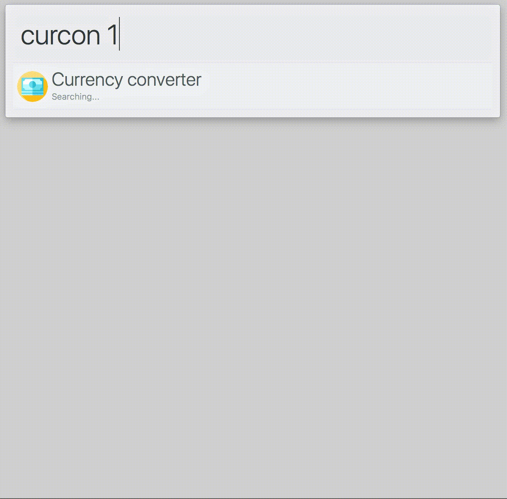

# alfred-currency-conversion [](https://travis-ci.org/jeppestaerk/alfred-currency-conversion)

> Alfred 3 workflow for Foreign exchange rates and currency conversion



## Install

```
$ npm install --global alfred-currency-conversion
```

*Requires [Node.js](https://nodejs.org) 4+ and the Alfred [Powerpack](https://www.alfredapp.com/powerpack/).*


## Features

* Set your own base currency (default `EUR`)
* Currencies: `AUD`, `BGN`, `BRL`, `CAD`, `CHF`, `CNY`, `CZK`, `DKK`, `EUR`, `GBP`, `HKD`, `HRK`, `HUF`, `IDR`, `ILS`, `INR`, `ISK`, `JPY`, `KRW`, `MXN`, `MYR`, `NOK`, `NZD`, `PHP`, `PLN`, `RON`, `RUB`, `SEK`, `SGD`, `THB`, `TRY`, `USD`, and `ZAR`
* Auto update rates everyday at 4PM CET
* Input support locale numbers
* Input support for <kbd>$</kbd> (`USD`), <kbd>€</kbd> (`EUR`), <kbd>£</kbd> (`GBP`), and <kbd>¥</kbd> (`JPY`)
* Outputs dates and numbers in locale


## Usage

In Alfred, type `curcon`, <kbd>Enter</kbd>, and your query.


## License

MIT © [Jeppe Stærk](https://staerk.io)


## Credits

* [alfy](https://github.com/sindresorhus/alfy) made by [Sindre Sorhus](https://sindresorhus.com/) is licensed by [MIT](https://github.com/sindresorhus/alfy/blob/master/license)
* [os-locale](https://github.com/sindresorhus/os-locale) made by [Sindre Sorhus](https://sindresorhus.com/) is licensed by [MIT](https://github.com/sindresorhus/os-locale/blob/master/license)
* Currency rates from [fixer.io](http://fixer.io/) via `https://api.fixer.io` (Updates once a day, approximately 4.00 PM CET)
* Icons made by [Freepik](http://www.freepik.com) from [www.flaticon.com](https://www.flaticon.com/) is licensed by [CC 3.0 BY](http://creativecommons.org/licenses/by/3.0/)
